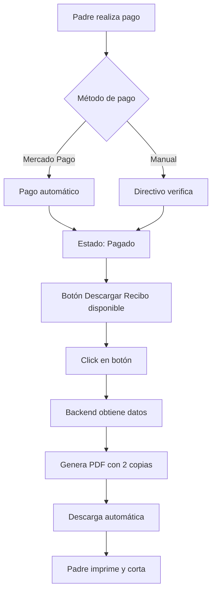

# 📄 Sistema de Recibos PDF

## 🎯 Descripción General

Sistema completo de generación de recibos de pago en formato PDF con diseño profesional que incluye **2 copias en una misma hoja** (Original y Copia) para facilitar la impresión y archivo.

---

## ✨ Características

### 1. **Formato de 2 Copias por Hoja**

Cada recibo PDF contiene DOS copias idénticas en una sola hoja:

```
┌────────────────────────────┐
│                            │
│    RECIBO DE PAGO          │
│      (ORIGINAL)            │
│                            │
│   [Datos completos]        │
│                            │
├─ ✂ Cortar por aquí ────────┤  ← Línea punteada
│                            │
│    RECIBO DE PAGO          │
│       (COPIA)              │
│                            │
│   [Datos completos]        │
│                            │
└────────────────────────────┘
```

**Ventajas:**
- Original para el padre/alumno
- Copia para archivo de la escuela
- Ahorro de papel (2 en 1)
- Fácil de cortar con tijera

---

## 📋 Contenido del Recibo

Cada recibo incluye:

### Encabezado
- **Nombre de la escuela** (configurable)
- Dirección (opcional)
- Teléfono (opcional)

### Información del Recibo
- **Número de recibo único** (8 caracteres del ID)
- **Fecha de pago** (formato: 15 de enero de 2025)

### Datos del Alumno
- Nombre completo
- Matrícula
- Grado y grupo (Ej: 6° A)

### Datos del Pago
- **Concepto** (Ej: Mensualidad, Inscripción, etc.)
- Descripción (si aplica)
- **Método de pago:**
  - Mercado Pago
  - Efectivo/Transferencia
- Referencia/Folio (si aplica)

### Monto
- **Total pagado** destacado en verde
- Formato: $1,234.56 MXN

### Información Adicional
- Nombre del pagador (padre)
- Nota al pie: "Este recibo es válido como comprobante de pago..."

---

## 🚀 Cómo Usar

### Como Padre:

1. Ve a `/padre/pagos`
2. Click en pestaña **"Historial"**
3. Busca el pago del que quieres el recibo
4. Click en botón **"Descargar Recibo"** 📥
5. El PDF se descargará automáticamente
6. Imprime y corta por la línea punteada

### Como Directivo:

1. Ve a `/directivo/pagos`
2. Busca el pago pagado en la tabla
3. Click en el icono de **descarga** (📥) en la columna de acciones
4. El PDF se descargará automáticamente

---

## 🔧 Configuración

### Personalizar Información de la Escuela

Edita el archivo `lib/recibo-pdf.ts` líneas 900-902:

```typescript
nombreEscuela: 'SISTEMA ESCOLAR', // ← Cambia esto
direccionEscuela: '',  // ← Agrega dirección
telefonoEscuela: ''    // ← Agrega teléfono
```

**Ejemplo:**

```typescript
nombreEscuela: 'ESCUELA PRIMARIA BENITO JUÁREZ',
direccionEscuela: 'Av. Revolución 123, Col. Centro, CDMX',
telefonoEscuela: 'Tel: (55) 1234-5678'
```

---

## 📐 Especificaciones Técnicas

### Formato del PDF
- **Tamaño:** Carta (215.9 x 279.4 mm)
- **Orientación:** Vertical (Portrait)
- **Librería:** jsPDF

### Estructura del Layout
- **Margen izquierdo/derecho:** 15mm
- **Separación entre copias:** 140mm
- **Línea de corte:** Línea punteada en Y=140mm

### Tipografía
- **Fuente:** Helvetica
- **Tamaños:**
  - Título escuela: 16pt (bold)
  - Título recibo: 14pt (bold)
  - Contenido: 9-10pt
  - Notas: 7-8pt

### Colores
- **Texto principal:** Negro (#000000)
- **Texto secundario:** Gris (#646464)
- **Monto:** Verde (#008000)
- **Línea de corte:** Gris claro (#969696)

---

## 🔐 Seguridad

### Validaciones

El sistema valida:

1. **Autenticación:**
   - Usuario debe estar autenticado
   - Solo usuarios autorizados pueden descargar

2. **Autorización:**
   - ✅ Directivo: Puede descargar cualquier recibo
   - ✅ Padre: Solo puede descargar recibos de sus pagos
   - ❌ Otros roles: No tienen acceso

3. **Estado del Pago:**
   - Solo se generan recibos para pagos con estado **"pagado"**
   - Pagos pendientes/vencidos no generan recibo

### Código de Seguridad

```typescript
// En app/actions/pagos-actions.ts
const esDirectivo = profile?.role === 'directivo'
const esPadre = padre.user_id === user.id

if (!esDirectivo && !esPadre) {
  return { success: false, error: 'No autorizado' }
}
```

---

## 📂 Archivos del Sistema

### Archivos Principales

| Archivo | Descripción |
|---------|-------------|
| `lib/recibo-pdf.ts` | Generador de PDFs con lógica de diseño |
| `app/actions/pagos-actions.ts` | Backend: obtener datos para recibo |
| `app/padre/pagos/PagosPadreContent.tsx` | UI: Botón descarga (padre) |
| `app/directivo/pagos/TablaPagos.tsx` | UI: Botón descarga (directivo) |

### Funciones Exportadas

```typescript
// lib/recibo-pdf.ts

// Generar PDF completo (devuelve objeto jsPDF)
generarReciboPDF(datos: DatosRecibo): jsPDF

// Descargar PDF directamente
descargarReciboPDF(datos: DatosRecibo, nombreArchivo?: string)

// Abrir en nueva ventana para imprimir
imprimirReciboPDF(datos: DatosRecibo)
```

---

## 🧪 Pruebas

### Probar el Sistema

1. **Crear un pago:**
   ```
   - Directivo → Pagos → Crear Pago
   - Asigna a un padre/alumno
   ```

2. **Registrar pago:**
   ```
   - Padre → Pagos → Pagar (Mercado Pago o Manual)
   ```

3. **Descargar recibo:**
   ```
   - Padre → Historial → Descargar Recibo
   - Directivo → Tabla de Pagos → Click en icono descarga
   ```

4. **Verificar el PDF:**
   - ✅ Contiene 2 copias
   - ✅ Línea punteada visible
   - ✅ Todos los datos correctos
   - ✅ Formato profesional
   - ✅ Se puede imprimir correctamente

---

## 🎨 Ejemplos Visuales

### Encabezado del Recibo

```
        SISTEMA ESCOLAR
    Av. Revolución 123, CDMX
         Tel: 55-1234-5678

        RECIBO DE PAGO
           (ORIGINAL)

No. Recibo: A1B2C3D4        Fecha: 15 de enero de 2025
─────────────────────────────────────────────────────────
```

### Sección de Datos

```
DATOS DEL ALUMNO
Nombre:     Juan Pérez García
Matrícula:  12345      Grado: 6° A

DETALLE DEL PAGO
Concepto:   Mensualidad
Método:     Mercado Pago
Referencia: MP-1234567890

─────────────────────────────────────────────────────────
TOTAL PAGADO:                         $1,500.00 MXN
─────────────────────────────────────────────────────────

Pagado por: María García López
```

---

## 💡 Casos de Uso

### 1. **Archivo Escolar**
- Imprimir recibo
- Cortar por línea punteada
- Original → Entregar al padre
- Copia → Archivar en expediente

### 2. **Control Financiero**
- Generar recibos masivos al final del mes
- Crear respaldo digital (PDFs archivados)
- Facilitar auditorías

### 3. **Comprobante para Padres**
- Padre descarga su recibo
- Guarda copia digital
- Imprime para sus registros

### 4. **Resolución de Conflictos**
- Padre: "No he pagado"
- Directivo: Descarga recibo con fecha y referencia
- Verificación rápida del pago

---

## 🔄 Flujo Completo



---

## 🐛 Troubleshooting

### Problema: "No autorizado para ver este recibo"
**Solución:** Verifica que el usuario logueado sea el padre del pago o un directivo.

### Problema: "El pago aún no ha sido procesado"
**Solución:** El recibo solo está disponible para pagos con estado "pagado".

### Problema: El PDF no muestra datos correctos
**Solución:** Verifica que el pago tenga toda la información relacionada (alumno, padre, concepto).

### Problema: La línea de corte no se ve
**Solución:** Verifica que estés usando una impresora que soporte líneas punteadas.

### Problema: El texto se corta o sale de la página
**Solución:** Revisa los márgenes en `lib/recibo-pdf.ts` y ajusta si es necesario.

---

## 🚀 Mejoras Futuras

Posibles mejoras al sistema:

- [ ] **Agregar logo de la escuela**
  - Subir imagen en configuración
  - Mostrar en encabezado

- [ ] **Código QR de verificación**
  - Generar QR con URL de verificación
  - Validar autenticidad del recibo

- [ ] **Envío por email automático**
  - Enviar recibo por correo al padre
  - Adjuntar PDF automáticamente

- [ ] **Recibos masivos**
  - Generar múltiples recibos en un solo PDF
  - Útil para finanzas

- [ ] **Plantillas personalizables**
  - Diferentes diseños de recibo
  - Selección por tipo de pago

- [ ] **Firma digital**
  - Firma del directivo
  - Sello oficial de la escuela

---

## 📖 Referencias

### Documentación Externa

- [jsPDF Documentación](https://github.com/parallax/jsPDF)
- [jsPDF Ejemplos](https://rawgit.com/MrRio/jsPDF/master/docs/index.html)

### Archivos Relacionados

- `MERCADOPAGO_SETUP.md` - Configuración de pagos
- `ESTADO_ACTUAL_SISTEMA.md` - Estado general del sistema
- `SISTEMA-CALIFICACIONES.md` - Sistema de calificaciones

---

**Última actualización:** 15 de Enero, 2025
**Versión:** 1.0
**Autor:** Sistema de IA Claude
